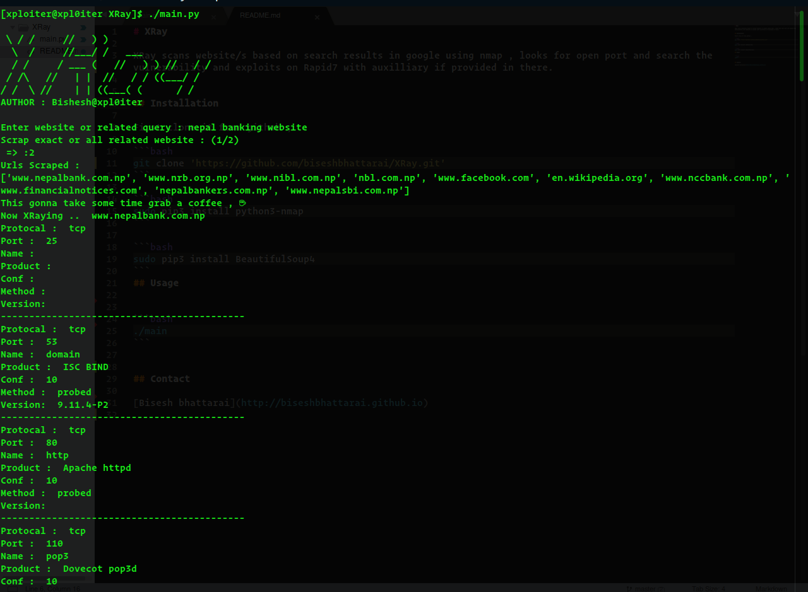

# XRay

XRay scans website/s based on search results in google using nmap , looks for open port and search the vulnerability and exploits on Rapid7 with auxilliary if provided in there.


## Installation

First clone it from github ,

```bash
git clone 'https://github.com/biseshbhattarai/XRay.git'
```

```bash
sudo pip3 install python3-nmap
```

```bash
sudo pip3 install BeautifulSoup4
```
## Usage


```bash
./main 
```
Below is a screenshot 



## Contact 

[Bisesh bhattarai](http://biseshbhattarai.github.io)
